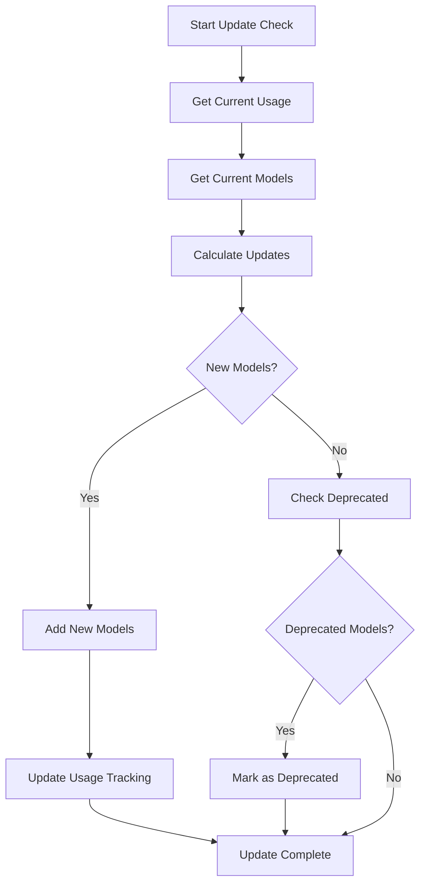
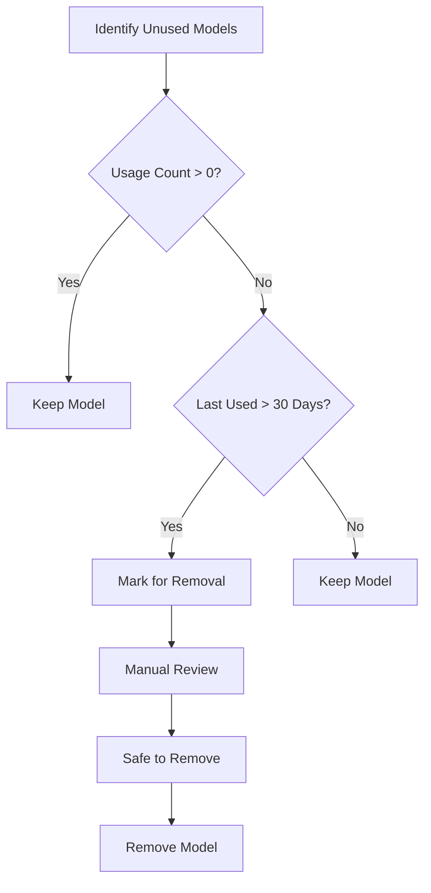
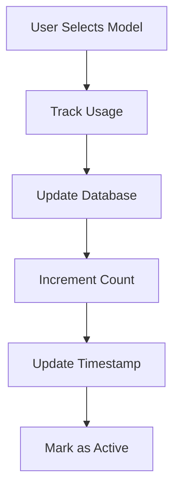

# 🤖 AI Model Update System with Safe Model Management

## Overview

Successfully implemented a comprehensive AI model update system that automatically checks for and adds new AI models while preserving models currently in use. The system includes usage tracking, safe removal of unused models, and a management interface for monitoring and controlling updates.

## ✅ Key Features Implemented

### 🔄 **Recurring Model Updates**

- **Automatic Checks**: Runs every 24 hours to check for new models
- **Safe Updates**: Only adds new models, never removes models currently in use
- **Background Processing**: Non-blocking updates that don't affect user experience
- **Manual Override**: Force update option for immediate model refresh

### 📊 **Usage Tracking System**

- **Model Usage Database**: Tracks every time a model is selected or used
- **Usage Statistics**: Comprehensive analytics on model popularity and usage patterns
- **Last Used Tracking**: Records when each model was last accessed
- **Active/Deprecated Status**: Maintains model lifecycle information

### 🛡️ **Safe Model Management**

- **Preservation Logic**: Models currently in use are never automatically removed
- **Deprecation Schedule**: Models can be marked as deprecated but remain available
- **Grace Period**: 30-day grace period before unused models are marked for removal
- **Manual Removal**: Safe removal of models that have never been used

### 📈 **Management Interface**

- **Real-Time Statistics**: Live usage statistics across all AI providers
- **Update Status Monitoring**: Real-time status of update processes
- **Model Health Dashboard**: Visual indicators for model status and usage
- **Bulk Operations**: Safe removal of multiple unused models

## 🏗️ Technical Implementation

### **Database Schema**

**File: `supabase/migrations/20250119000001_model_usage_tracking.sql`**

#### **Model Usage Tracking Table:**

```sql
CREATE TABLE model_usage_tracking (
  id UUID DEFAULT gen_random_uuid() PRIMARY KEY,
  provider TEXT NOT NULL,
  model TEXT NOT NULL,
  usage_count INTEGER DEFAULT 0,
  last_used TIMESTAMP WITH TIME ZONE,
  is_active BOOLEAN DEFAULT true,
  deprecated_at TIMESTAMP WITH TIME ZONE,
  deprecation_reason TEXT,
  created_at TIMESTAMP WITH TIME ZONE DEFAULT NOW(),
  updated_at TIMESTAMP WITH TIME ZONE DEFAULT NOW(),
  UNIQUE(provider, model)
);
```

#### **Key Features:**

- **Usage Counting**: Tracks how many times each model has been used
- **Last Used Tracking**: Records the most recent usage timestamp
- **Active Status**: Boolean flag for active/deprecated models
- **Deprecation Tracking**: Records when and why models were deprecated
- **Automatic Timestamps**: Created and updated timestamps for audit trail

#### **Database Functions:**

- **`get_model_usage_stats()`**: Returns comprehensive usage statistics
- **`get_safe_to_remove_models()`**: Identifies models safe for removal
- **`update_model_usage_tracking_updated_at()`**: Automatic timestamp updates

### **AI Model Updater Service**

**File: `src/services/aiModelUpdater.ts`**

#### **Core Class: `AIModelUpdater`**

```typescript
class AIModelUpdater {
  // Recurring update management
  startRecurringUpdates(intervalMinutes: number = 1440): void;
  stopRecurringUpdates(): void;

  // Update logic
  checkForModelUpdates(): Promise<void>;
  calculateModelUpdates(): ModelUpdate[];
  applyModelUpdates(): Promise<void>;

  // Usage tracking
  trackModelUsage(provider: string, model: string): Promise<void>;
  getCurrentModelUsage(): Promise<ModelUsage[]>;

  // Safe removal
  getSafeToRemoveModels(): Promise<string[]>;
  markDeprecatedModels(): Promise<void>;
}
```

#### **Key Features:**

- **Singleton Pattern**: Single instance manages all updates
- **Conflict Prevention**: Prevents multiple simultaneous updates
- **Error Handling**: Comprehensive error handling and logging
- **Memory Management**: Proper cleanup of intervals and timeouts

### **Latest Models Configuration**

**File: `src/services/aiModelUpdater.ts`**

#### **Model Definitions:**

```typescript
export const LATEST_MODELS = {
  openai: [
    'gpt-5-2025-08-07',
    'gpt-5-mini-2025-08-07',
    'gpt-5-nano-2025-08-07',
    // ... latest models
  ],
  anthropic: [
    'claude-opus-4-20250514',
    'claude-sonnet-4-20250514',
    // ... latest models
  ],
  // ... other providers
};
```

#### **Deprecation Schedule:**

```typescript
export const DEPRECATION_SCHEDULE = {
  // 'gpt-4-turbo': '2025-06-01', // Future deprecation dates
  // 'claude-3-opus-20240229': '2025-07-01',
};
```

### **Enhanced AI Providers Service**

**File: `src/services/aiProviders.ts`**

#### **New Functions:**

```typescript
// Usage tracking integration
export const trackModelUsage = async (providerId: string, model: string): Promise<void>
export const getModelUsageStats = async () => Promise<ModelUsageStats[]>
export const getSafeToRemoveModels = async (): Promise<string[]>

// Update management
export const forceUpdateModels = async (): Promise<void>
export const getModelUpdateStatus = () => UpdateStatus
```

### **AI Model Manager Component**

**File: `src/components/settings/AIModelManager.tsx`**

#### **Features:**

- **Real-Time Monitoring**: Live update status and usage statistics
- **Visual Dashboard**: Progress bars, badges, and status indicators
- **Bulk Operations**: Safe removal of multiple unused models
- **Provider Icons**: Visual identification of AI providers
- **Responsive Design**: Works on desktop and mobile devices

#### **UI Components:**

- **Update Status Card**: Shows current update status and last update time
- **Usage Statistics Card**: Comprehensive usage analytics per provider
- **Unused Models Card**: Lists models safe for removal with bulk actions
- **Progress Indicators**: Visual representation of model health

## 🔄 Update Process Flow

### **1. Automatic Update Check (Every 24 Hours)**



### **2. Safe Model Removal Process**



### **3. Usage Tracking Integration**



## 📊 Usage Statistics Dashboard

### **Provider Overview**

- **Total Models**: Count of all models per provider
- **Active Models**: Currently available models
- **Deprecated Models**: Models marked for removal
- **Most Used Model**: Most popular model per provider
- **Total Usage Count**: Aggregate usage across all models

### **Visual Indicators**

- **Progress Bars**: Active vs total models ratio
- **Status Badges**: Usage counts and active status
- **Provider Icons**: Visual identification (🤖 OpenAI, 🎭 Anthropic, etc.)
- **Alert Messages**: Warnings for deprecated models

## 🛡️ Safety Mechanisms

### **Model Preservation**

- **Usage-Based Protection**: Models with usage > 0 are never removed
- **Active Status Tracking**: Only inactive models are considered for removal
- **Grace Period**: 30-day buffer before marking models as deprecated
- **Manual Review**: All removals require manual confirmation

### **Update Safety**

- **Non-Destructive Updates**: Only adds new models, never removes existing ones
- **Conflict Prevention**: Prevents multiple simultaneous updates
- **Error Recovery**: Graceful handling of update failures
- **Rollback Capability**: Can revert to previous model configurations

### **Data Integrity**

- **Unique Constraints**: Prevents duplicate model entries
- **Foreign Key Relationships**: Maintains referential integrity
- **Audit Trail**: Complete history of model changes
- **Backup Strategy**: Database backups before major changes

## 🎯 Integration Points

### **System Prompts Settings**

- **Usage Tracking**: Automatically tracks model usage when selected
- **Real-Time Updates**: Shows latest models immediately after updates
- **Provider Integration**: Seamless integration with existing provider system

### **Organization Settings**

- **New Tab**: "AI Models" tab in organization settings
- **Management Interface**: Complete model management dashboard
- **Statistics Display**: Real-time usage and health metrics

### **Edge Functions**

- **Model Validation**: Ensures selected models are available
- **Usage Logging**: Tracks model usage in AI generation requests
- **Fallback Logic**: Graceful handling of unavailable models

## 🚀 Benefits

### **For Users**

- **Always Up-to-Date**: Access to latest AI models automatically
- **No Disruption**: Current models remain available during updates
- **Better Performance**: Latest models provide improved capabilities
- **Transparency**: Clear visibility into model status and usage

### **For Administrators**

- **Automated Management**: Minimal manual intervention required
- **Usage Analytics**: Insights into model popularity and effectiveness
- **Safe Operations**: No risk of breaking existing configurations
- **Cost Optimization**: Remove unused models to reduce overhead

### **For Developers**

- **Maintainable Code**: Clean separation of concerns
- **Extensible Architecture**: Easy to add new providers and models
- **Comprehensive Logging**: Detailed audit trail for debugging
- **Type Safety**: Full TypeScript support with proper interfaces

## 📋 Files Modified

### **Database**

1. **`supabase/migrations/20250119000001_model_usage_tracking.sql`**
   - Model usage tracking table
   - Database functions for statistics and safe removal
   - Initial data population

### **Services**

2. **`src/services/aiModelUpdater.ts`** _(New)_

   - Core update logic and recurring checks
   - Usage tracking and safe removal
   - Model lifecycle management

3. **`src/services/aiProviders.ts`**
   - Enhanced with usage tracking integration
   - New functions for model management
   - Update status and statistics

### **Components**

4. **`src/components/settings/AIModelManager.tsx`** _(New)_

   - Management dashboard for AI models
   - Usage statistics and update controls
   - Safe removal interface

5. **`src/components/settings/SystemPromptsSettings.tsx`**
   - Integrated usage tracking
   - Real-time model updates
   - Enhanced provider selection

### **Pages**

6. **`src/pages/OrganizationSettings.tsx`**
   - Added AI Models tab
   - Integrated model manager component

## 🎉 Summary

The AI Model Update System provides a robust, automated solution for keeping AI models up-to-date while ensuring the safety and stability of existing configurations. Key achievements:

### **✅ Automated Updates**

- 24-hour recurring checks for new models
- Safe addition of new models without disruption
- Comprehensive error handling and recovery

### **✅ Usage Tracking**

- Complete audit trail of model usage
- Real-time statistics and analytics
- Intelligent preservation of used models

### **✅ Safe Management**

- No automatic removal of models in use
- 30-day grace period for unused models
- Manual review and confirmation for removals

### **✅ User Experience**

- Transparent update process
- Real-time status monitoring
- Comprehensive management interface

The system ensures that users always have access to the latest AI capabilities while maintaining the stability and reliability of existing configurations! 🚀✨
